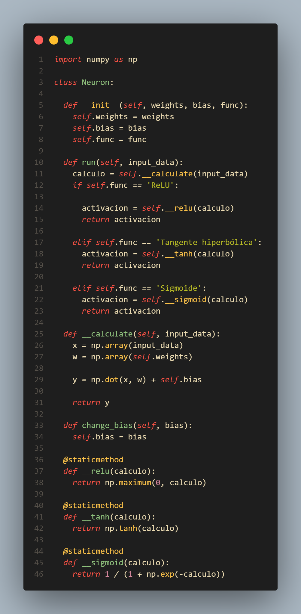
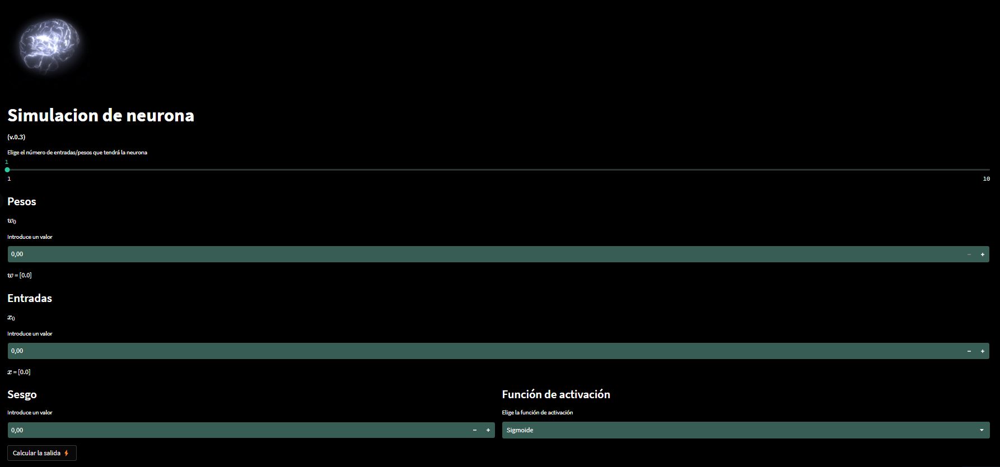

(Descripción en desarrollo)

# Simulación de una neurona
El objetivo de esta aplicación es comprender el funcionamiento de un perceptrón, que es la representación artificial de una neurona humana, junto con las funciones de activación, que nos permiten ajustar el resultado de la salida de la neurona.

### Tecnologias usadas:

### La aplicación:
Puedes probar esta aplicación en el siguiente enlace: 

## Desarrollo de la aplicación
---

### La formula matematica
$$y = f(xw + b) = f(\sum_{i=1}^nx_nw_n+b)$$

### La formula en python

`y = np.dot(x, w) + self.bias`

### La neurona inplementada con Python
---

### Representación de la aplicación:

